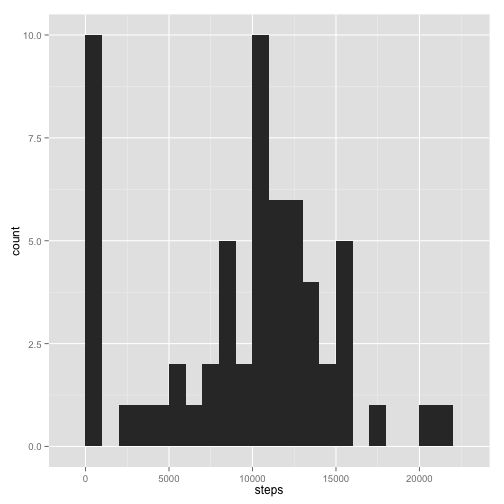
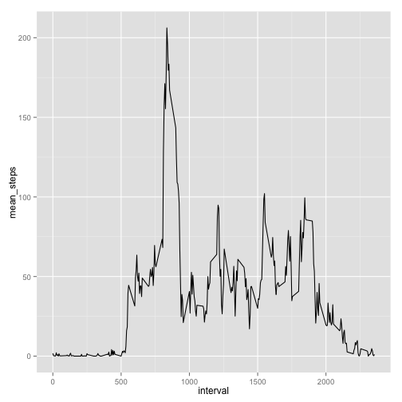
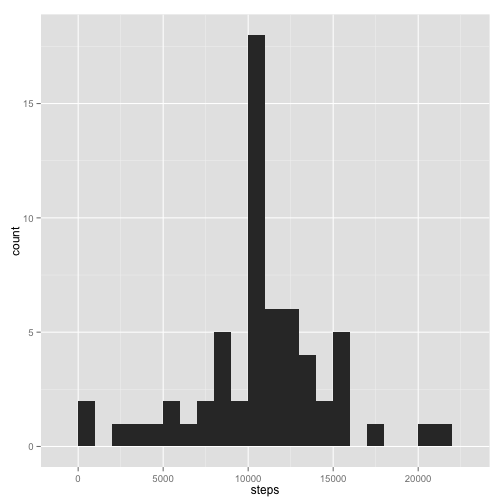
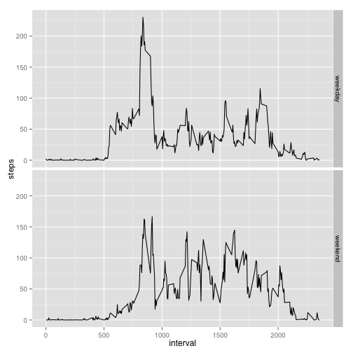

## Loading and preprocessing the data

Before working with the data, we need to load it. We will also transform the date column to Date type.


```r
activities = read.csv('activity.csv', header = T)
activity$date <- as.Date(activity$date)
```


## What is mean total number of steps taken per day?

For getting an answer to this question, we need to get a new data frame with the total steps added for each date. With it, we can create an histogram, and calculate the mean and median.


```r
library(ggplot2)
a <- aggregate(steps ~ date, activities[!is.na(activities["steps"]),], sum)
ggplot(a, aes(x = steps)) + geom_histogram(binwidth = 1000)
```

 

```r
mean(a$steps, na.rm = TRUE)
```

```
## [1] 10766.19
```

```r
median(a$steps, na.rm = TRUE)
```

```
## [1] 10765
```


## What is the average daily activity pattern?

Again, for answering this question we need to create a new data frame, this time with the mean of steps for each interval. With it, we can create a plot and calculate the interval with most steps.


```r
b <- aggregate(steps ~ interval, activities[!is.na(activities["steps"]),], mean)
names(b)[2] <- "mean_steps"
ggplot(b, aes(x = interval, y = mean_steps)) + geom_line()
```

 

```r
b[order(b$mean_steps, decreasing = TRUE),][1,]
```

```
##     interval mean_steps
## 104      835   206.1698
```


## Imputing missing values

The `complete.cases` makes very easy to find the rows with `NANs`. 

Filling those missing values is slightly more complicated. We decided to merge the original data frame with the one generated in the previous exercise, which contains the step mean by interval. Then we can fill the missing steps value with the value of the mean for that period. Finally we just remove the mean steps column.

Once we have filled the data, we can generate a new data frame with the total sum of steps by date, in the same way we created one in the first exercise. With it, we can create an histogram, and calculate the mean and median.


```r
nrow(activities[!complete.cases(activities),])
```

```
## [1] 2304
```

```r
no_nans <- merge(activities, b, by="interval")
no_nans$steps <- ifelse(is.na(no_nans$steps), round(no_nans$mean_steps), no_nans$steps)
no_nans$mean_steps <- NULL

c <- aggregate(steps ~ date, no_nans, sum)
ggplot(c, aes(x = steps)) + geom_histogram(binwidth = 1000)
```

 

```r
mean(c$steps, na.rm = TRUE)
```

```
## [1] 10765.64
```

```r
median(c$steps, na.rm = TRUE)
```

```
## [1] 10762
```


## Are there differences in activity patterns between weekdays and weekends?

For answering this question we will need to add a column stating if the sample was taking on a weekday or a workday. We can do that easily, creating a new column (`weekpart`) and filling it using `ifelse` and the `weekdays` method on the `date` column.

Once we have this data, there are multiple ways to proceed. We decided to create two different dataframes, one with the mean steps by interval for weekdays and the other with the mean steps by interval for weekends. Finally, we merge both dataframes, which are very similar but with different values in the `weekpart` column.

With this data frame, we can generate a plot that answers the question. The plot will be very similar to the barplot in the second exercise, with the difference that we will generate a grid based on the part of the week the samples are.

```r
no_nans$date <- as.Date(no_nans$date)
no_nans$weekpart <- as.factor(ifelse(weekdays(no_nans$date) %in% c("Saturday","Sunday"), "weekend", "weekday"))

d <- aggregate(steps ~ interval, no_nans[no_nans$weekpart == "weekday", ], mean)
d$weekpart <- "weekday"
e <- aggregate(steps ~ interval, no_nans[no_nans$weekpart == "weekend", ], mean)
e$weekpart <- "weekend"
f <- merge(d,e, all=TRUE)

ggplot(f, aes(x = interval, y = steps)) + geom_line() + facet_grid(weekpart ~ .)
```

 
